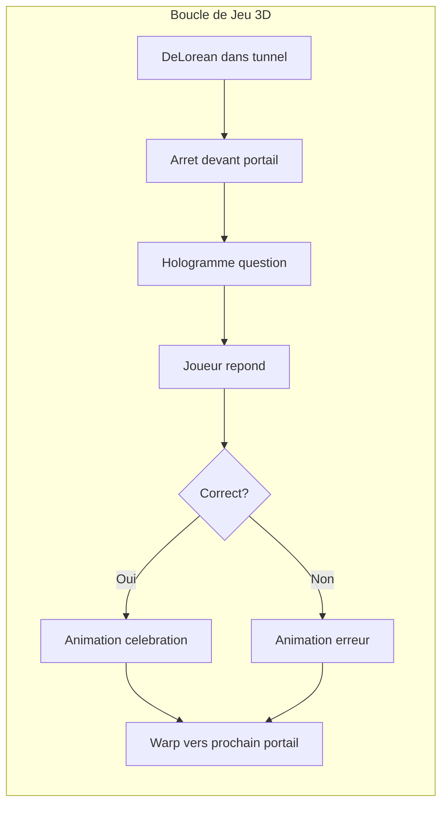

# Frontend 3D - DeLorean dans le Tunnel Temporel

## Concept Global

Une DeLorean stylisee cyberpunk/neon voyage a travers un tunnel temporel. A chaque question, la voiture s'arrete devant un portail lumineux representant une epoque. Un hologramme flottant affiche la question et les options de reponse. Apres la reponse, la voiture accelere vers le prochain portail avec des effets de vitesse lumiere.




## Architecture des Composants 3D

```javascript
frontend/src/components/three/
├── TimeTravelScene.tsx      # Scene principale avec Canvas
├── DeLorean.tsx             # Modele 3D de la voiture
├── TimeTunnel.tsx           # Tunnel neon anime
├── TimePortal.tsx           # Portails des epoques
├── HologramQuestion.tsx     # Question holographique
├── WarpEffect.tsx           # Effets de voyage temporel
├── NeonGrid.tsx             # Sol grille cyberpunk
└── CameraController.tsx     # Camera qui suit la voiture
```


## Details des Composants Principaux

### 1. TimeTravelScene - Scene Principale

Fichier: [`frontend/src/components/three/TimeTravelScene.tsx`](frontend/src/components/three/TimeTravelScene.tsx)

- Canvas React Three Fiber avec post-processing (bloom pour l'effet neon)
- Gestion des etats de jeu (idle, moving, answering, warping)
- Orchestration des animations entre questions

### 2. DeLorean - Le Vehicule

Fichier: [`frontend/src/components/three/DeLorean.tsx`](frontend/src/components/three/DeLorean.tsx)

- Modele low-poly stylise avec materiaux emissifs neon
- Phares et flux capacitor lumineux (bleu/rose cyberpunk)
- Animations: idle (flottement), acceleration, celebration
- Traces lumineuses derriere le vehicule

### 3. TimeTunnel - L'Environnement

Fichier: [`frontend/src/components/three/TimeTunnel.tsx`](frontend/src/components/three/TimeTunnel.tsx)

- Cylindre avec anneaux neon defilants
- Particules lumineuses qui passent a grande vitesse
- Couleurs qui changent selon l'epoque (ex: 1950=vert retro, 2020=rose/cyan)
- Sol grille infini style synthwave

### 4. TimePortal - Les Portails d'Epoque

Fichier: [`frontend/src/components/three/TimePortal.tsx`](frontend/src/components/three/TimePortal.tsx)

- Anneau lumineux avec date affichee
- Effet de distorsion au centre (shader)
- Animation de pulsation quand actif
- Couleur selon le chapitre (chapter_1 = dore, chapter_4 = cyan)

### 5. HologramQuestion - Interface Holographique

Fichier: [`frontend/src/components/three/HologramQuestion.tsx`](frontend/src/components/three/HologramQuestion.tsx)

- Panneau flottant avec effet scanline
- Texte du prompt avec effet de glitch subtil
- Boutons 3D pour les options de reponse
- Feedback visuel correct/incorrect (vert/rouge pulsant)

## Integration avec le Jeu Existant

Le composant `TimeTravelScene` s'integrera dans [`frontend/src/pages/Game.tsx`](frontend/src/pages/Game.tsx) et utilisera le store Zustand existant ([`frontend/src/store/gameStore.ts`](frontend/src/store/gameStore.ts)) pour:

- Recuperer la question courante (`getCurrentItem`)
- Soumettre les reponses (`answerQuestion`)
- Gerer la progression (`nextQuestion`)

## Flux d'Experience Utilisateur

1. **Demarrage**: DeLorean au centre du tunnel, premier portail visible au loin
2. **Deplacement**: Animation smooth vers le portail (2-3 secondes)
3. **Question**: Hologramme apparait avec effet de materialisation
4. **Reponse**: Le joueur clique sur un bouton holographique
5. **Feedback**: 

- Correct: Flash vert, son positif, +points affiche en 3D
- Incorrect: Flash rouge, affichage de la bonne reponse

6. **Transition**: Effet "warp" vers le prochain portail
7. **Fin**: Animation speciale de sortie du tunnel

## Style Visuel Cyberpunk/Neon

- **Palette principale**: Noir profond, cyan (#00FFFF), magenta (#FF00FF), bleu electrique (#0080FF)
- **Effets**: Bloom intense, lignes neon, reflets metalliques
- **Typographie 3D**: Police futuriste avec glow
- **Particules**: Trainees lumineuses, etincelles

## Performance

- Utilisation de `instancedMesh` pour les elements repetitifs du tunnel
- LOD (Level of Detail) pour les objets distants