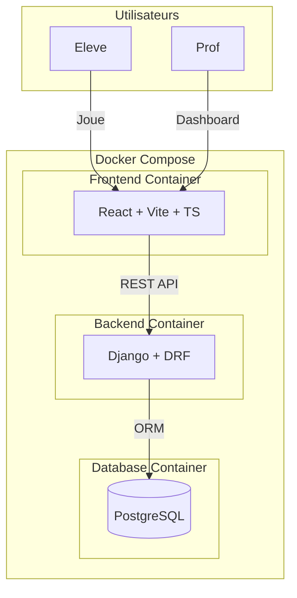
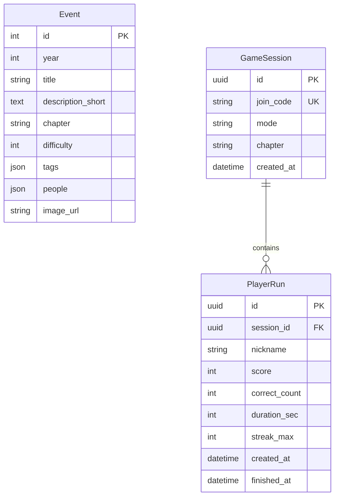

# IA Time Traveler - Plan de développement MVP

## Architecture globale




## Structure du monorepo

```javascript
/IA Time Travel/
├── docker-compose.yml
├── .env.example
├── README.md
├── backend/
│   ├── Dockerfile
│   ├── requirements.txt
│   ├── manage.py
│   ├── config/
│   │   ├── settings.py
│   │   ├── urls.py
│   │   └── wsgi.py
│   ├── timeline/
│   │   ├── models.py (Event)
│   │   ├── serializers.py
│   │   ├── views.py
│   │   ├── urls.py
│   │   └── fixtures/events.json
│   ├── sessions/
│   │   ├── models.py (GameSession, PlayerRun)
│   │   ├── serializers.py
│   │   ├── views.py
│   │   └── urls.py
│   └── tests/
└── frontend/
    ├── Dockerfile
    ├── package.json
    ├── vite.config.ts
    ├── index.html
    ├── .env.example
    └── src/
        ├── main.tsx
        ├── App.tsx
        ├── styles/
        │   └── variables.css (tokens CSS)
        ├── components/
        │   ├── InteractiveDots.tsx
        │   ├── ui/ (Button, Card, Badge, Modal)
        │   ├── Timeline.tsx
        │   ├── EventCard.tsx
        │   └── FeedbackPanel.tsx
        ├── pages/
        │   ├── Home.tsx
        │   ├── Lobby.tsx
        │   ├── Game.tsx
        │   ├── End.tsx
        │   └── ProfDashboard.tsx
        ├── games/
        │   ├── OrderGame.tsx
        │   └── TrueFalseGame.tsx
        ├── hooks/
        ├── store/ (Zustand)
        ├── api/
        └── utils/
            └── pdfGenerator.ts
```


## Backend Django + DRF

### Modeles de donnees




### Endpoints API v1

| Methode | Endpoint | Description ||---------|----------|-------------|| GET | `/api/v1/chapters/` | Liste des chapitres disponibles || GET | `/api/v1/events/?chapter=...` | Events filtres par chapitre || GET | `/api/v1/quiz/?chapter=...&count=10&mode=mcq` | Set de questions quiz || POST | `/api/v1/sessions/` | Creer session prof (retourne join_code) || POST | `/api/v1/sessions/join/` | Rejoindre session (nickname + join_code) || GET | `/api/v1/sessions/{join_code}/scoreboard/` | Classement de la session || POST | `/api/v1/runs/finish/` | Enregistrer score final |

### Fixtures initiales (24-30 evenements)

Evenements cles inclus :

- 1843: Ada Lovelace (premier algorithme)
- 1950: Alan Turing (Test de Turing)
- 1956: Conference Dartmouth (naissance du terme IA)
- 1966: ELIZA (premier chatbot)
- 1970s: Systemes experts (MYCIN, DENDRAL)
- 1997: Deep Blue vs Kasparov
- 2011: Watson gagne Jeopardy
- 2012: AlexNet revolutionne ImageNet
- 2016: AlphaGo bat Lee Sedol
- 2017: Transformers "Attention is All You Need"
- 2022: ChatGPT lance l'ere generative
- 2023+: Explosion IA generatives

## Frontend React + Vite + TS

### Design System - Theme Dark Futuriste

Tokens CSS centralises dans `variables.css` :

```css
:root {
  --aa-bg: #0a0a0f;
  --aa-bg-secondary: #12121a;
  --aa-text: #e8e8f0;
  --aa-text-muted: #8888a0;
  --aa-accent: #00d4ff;
  --aa-accent-secondary: #8b5cf6;
  --aa-dot: #2a2a40;
  --aa-glow: rgba(0, 212, 255, 0.4);
  --aa-border: rgba(255, 255, 255, 0.1);
  --aa-glass: rgba(18, 18, 26, 0.7);
  --aa-success: #10b981;
  --aa-error: #ef4444;
}
```


### Composants principaux

1. **InteractiveDots** : Canvas avec grille de points reagissant au curseur
2. **Timeline** : Frise 1950-aujourd'hui avec reperes decennies + zones drop
3. **EventCard** : Style glassmorphism avec glow au hover
4. **FeedbackPanel** : Modal/Drawer pour "En savoir plus"
5. **UI Kit** : Button, Card, Badge avec effets neon

### Gestion d'etat (Zustand)

```typescript
interface GameStore {
  currentEvent: Event | null;
  score: number;
  streak: number;
  answeredEvents: Event[];
  mode: 'mcq' | 'dnd';
  // actions
  answerCorrect: (bonusTime: number) => void;
  answerWrong: () => void;
  nextEvent: () => void;
}
```


### Systeme de scoring

- Bonne reponse : +100 points
- Bonus rapidite : +0 a +50 (selon temps de reponse)
- Mauvaise reponse : -30 points
- Streak : +20 par bonne reponse consecutive (cap +100)

### Mini-jeux (V1)

1. **OrderGame** : Remettre 5 cartes dans l'ordre chronologique
2. **TrueFalseGame** : 10 affirmations Vrai/Faux sur l'histoire de l'IA

### Generation PDF (jsPDF)

PDF de fin de partie contenant :

- Titre et chapitre joue
- Score final et statistiques
- Liste chronologique des evenements rencontres
- Mini frise textuelle

## Docker Configuration

### docker-compose.yml

Services :

- **db** : PostgreSQL 15 (port 5432)
- **backend** : Django sur port 8000, depend de db
- **frontend** : Vite dev server sur port 5173

### Workflow de demarrage

```bash
# 1. Copier les fichiers d'environnement
cp .env.example .env
cp frontend/.env.example frontend/.env

# 2. Lancer les conteneurs
docker compose up --build

# 3. Migrations + seed (dans un autre terminal)
docker compose exec backend python manage.py migrate
docker compose exec backend python manage.py loaddata events

# 4. Acceder a l'application
# Frontend: http://localhost:5173
# Backend API: http://localhost:8000/api/v1/
# Admin Django: http://localhost:8000/admin/
```


## Decisions techniques prises

| Decision | Choix | Justification ||----------|-------|---------------|| State management | Zustand | Leger, simple, TypeScript natif || Drag and Drop | @dnd-kit | Moderne, accessible, bien maintenu || PDF generation | jsPDF | Leger, pas de dependance serveur || Mode DnD simplifie | Drop sur decennies | Plus adapte au niveau college || Polling scoreboard | 3 secondes | Simple, suffisant pour classe || UUID vs int | UUID pour sessions/runs | Securite des join_codes |

## Tests

### Backend

- Test endpoint `/api/v1/quiz/` : verification structure reponse
- Test endpoint `/api/v1/sessions/{join_code}/scoreboard/` : classement
- Test creation session et join

### Frontend

- Tests unitaires composants UI (vitest)
- Test integration flow de jeu basique

## Fichiers cles a creer

1. `docker-compose.yml` - Orchestration des 3 services
2. `backend/config/settings.py` - Configuration Django avec PostgreSQL et CORS
3. `backend/timeline/fixtures/events.json` - 24-30 evenements historiques
4. `frontend/src/styles/variables.css` - Tokens du design system
5. `frontend/src/components/InteractiveDots.tsx` - Effet canvas interactif
6. `frontend/src/store/gameStore.ts` - Etat global du jeu